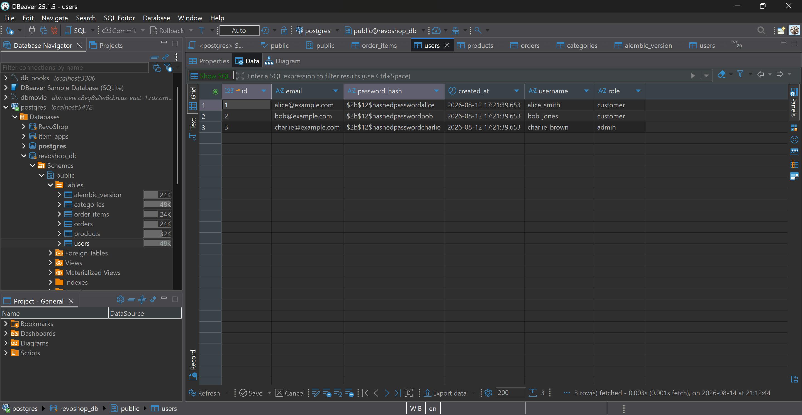
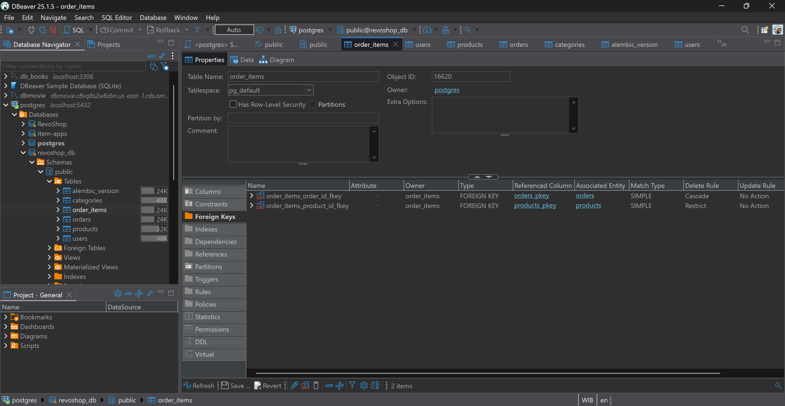

# RevoShop Backend — Checkpoint 2: Flask & SQLAlchemy Layer

Welcome to Checkpoint 2 of the **RevoShop** backend application! This stage builds directly upon the database foundation established in Checkpoint 1 by introducing a Flask application layer, SQLAlchemy ORM models, Flask-Migrate schema updates, and live API endpoints.

---

## 🚀 What's New in Checkpoint 2

- **Application Factory Pattern:** Modular application structure utilizing Flask Blueprints.
- **SQLAlchemy ORM Mapping:** Direct object-relational mapping for `User`, `Category`, `Product`, `Order`, and the `order_items` junction table.
- **Database Migrations:** Schema evolution managed via `Flask-Migrate` (Alembic), introducing the `role` column on the `users` table without data loss.
- **API Endpoints:**
  - Hardcoded product lookup routes (`GET /products`, `GET /products/<id>`).
  - Database-backed user registration (`POST /users/register`).
  - Database-backed user retrieval (`GET /users/<id>`).
- **Postman API Documentation:** Fully documented request/response examples for all endpoints.

---

## 📚 API Documentation

Interactive Postman API documentation containing full request bodies, headers, status codes, and example payloads:

👉 **[View RevoShop Postman API Documentation](https://documenter.getpostman.com/view/27743466/2sBYApysck#86279202-d1d5-4feb-b6a4-b9df51af69f4)**

---

## 🖼️ Database & Verification Screenshots

### 1. User Table Schema Migration

Confirms the successful execution of `flask db upgrade`, adding the `role` column to the `users` table with default value `'customer'`.



---

### 2. Junction Table (`order_items`) Association

Confirms the creation and mapping of the `order_items` association table, linking orders to multiple products in a many-to-many relationship.



---

## 🛠️ Project Structure

```text
revoshop-backend/
├── app/
│   ├── __init__.py           # Application factory & extension initialization
│   ├── models.py             # SQLAlchemy models & order_items association table
│   └── routes/
│       ├── __init__.py
│       ├── products.py       # Product endpoints
│       └── users.py          # User registration & lookup endpoints
├── migrations/               # Flask-Migrate (Alembic) version history
├── sql/
│   ├── schema.sql            # Checkpoint 1 SQL schema
│   ├── seed.sql              # Updated sample data
│   └── queries.sql           # Verification SQL queries
├── .gitignore
├── config.py                 # Database URI & configuration settings
├── README.md                 # Project documentation
├── requirements.txt          # Dependencies
└── run.py                    # Application entrypoint
```
