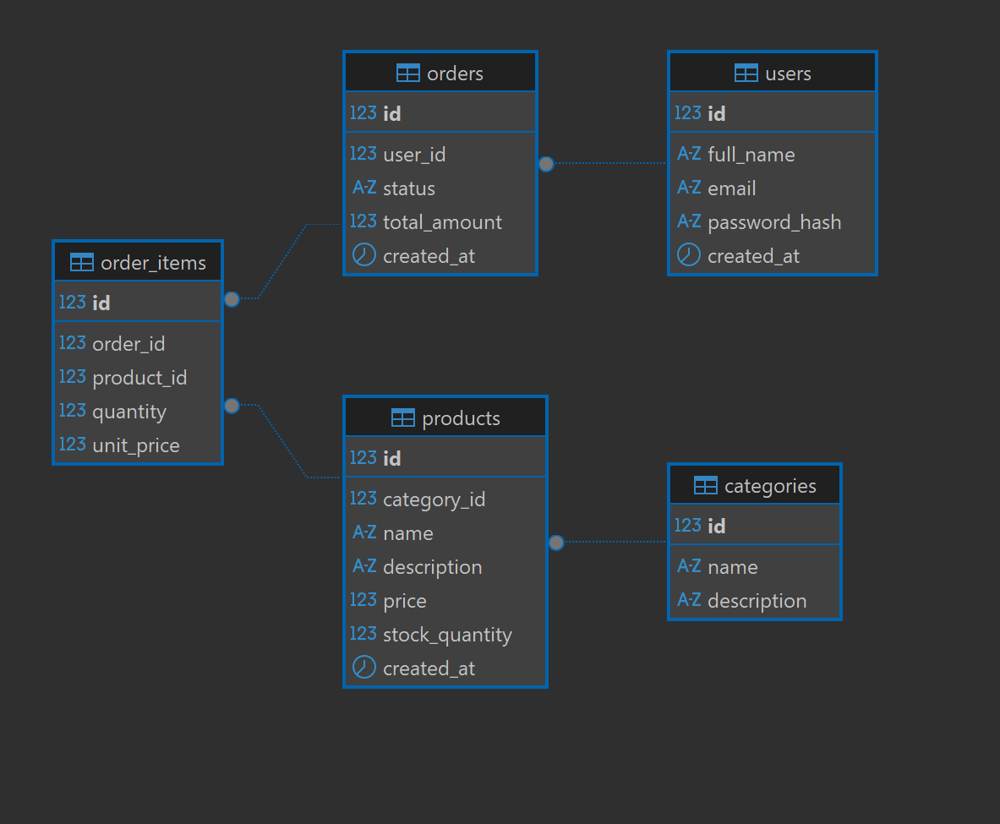

<!-- [](https://classroom.github.com/a/wGq_UtnU) -->

# RevoShop Database Design (Checkpoint 1)

This repository contains the core PostgreSQL database schema design, initial seed data, and verification queries for RevoShop.

## 📊 Entity Relationship Diagram (ERD)

The database structure consists of 5 tables: `users`, `categories`, `products`, `orders`, and `order_items`.



---

## 🚀 Local Setup Instructions

### Prerequisites

- [PostgreSQL](https://www.postgresql.org/) (v14 or higher recommended)
- [pgAdmin 4](https://www.pgadmin.org/) or PostgreSQL CLI (`psql`)

### Step 1: Create Database

1. Open pgAdmin or login via `psql`.
2. Execute:
   ```sql
   CREATE DATABASE revoshop_db;
   ```
