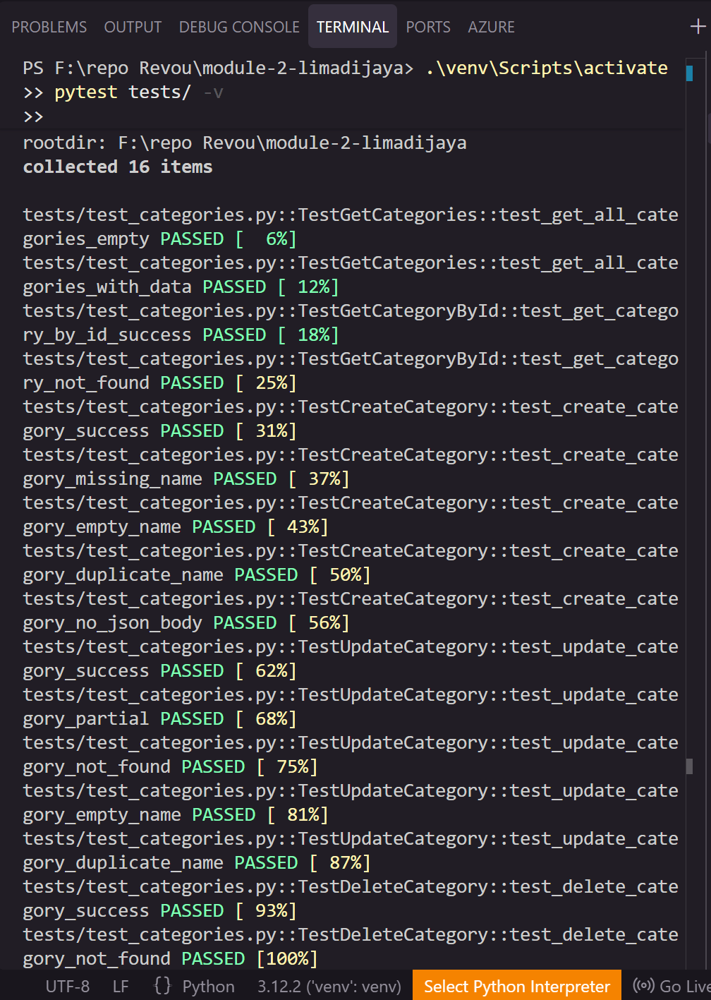
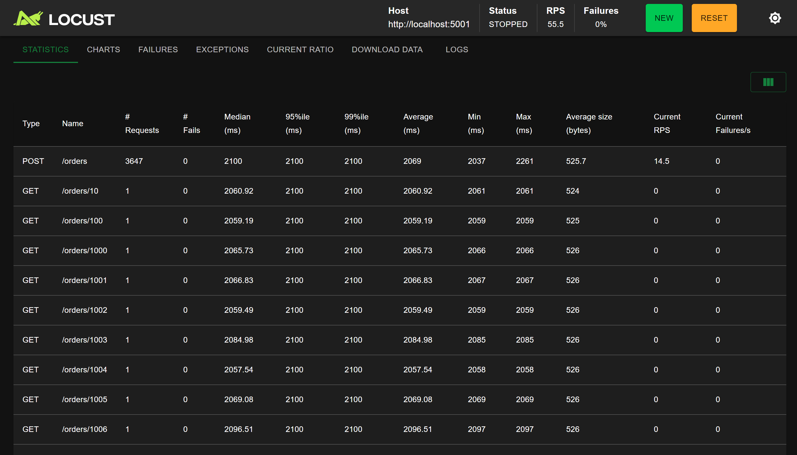

# RevoShop API

A RESTful e-commerce backend API built with Flask and PostgreSQL. RevoShop provides full CRUD operations for products, categories, orders, and users, with a many-to-many relationship between orders and products through an order_items junction table.

## Features

- **User Management** — Register new users with secure password hashing (Werkzeug), retrieve user profiles.
- **Authentication** — Login endpoint that verifies credentials using Werkzeug's `check_password_hash`.
- **Product CRUD** — Create, read, update, and delete products with validation. Delete is blocked if active orders reference the product (deletion guard).
- **Category CRUD** — Full management of product categories. GET by ID includes associated products.
- **Order CRUD** — Place orders linked to users with multiple items, view orders with product details, update order status, delete orders.
- **Many-to-Many Relationship** — Orders and products are linked through `order_items` with quantity and unit price tracking.
- **Data Validation** — Input validation on all POST/PUT endpoints with meaningful error messages.
- **Error Handling** — Try/except blocks with proper HTTP status codes and JSON error responses.
- **Deletion Guard** — Products with active orders cannot be deleted (returns 400 with explanation).

## Technologies Used

- **Flask** — Lightweight Python web framework
- **SQLAlchemy** — ORM for database operations
- **Flask-Migrate** — Database migration management (Alembic)
- **PostgreSQL** — Production relational database, hosted on **Supabase**
- **pgAdmin / DBeaver** — Database administration tools
- **pytest** — Unit and integration testing
- **Locust** — Load/performance testing
- **python-dotenv** — Environment variable management

## API Endpoints

### User Module
| Method | Endpoint | Description |
|--------|----------|-------------|
| POST | `/users` | Register a new user |
| GET | `/users/<id>` | Get user by ID |

### Authentication
| Method | Endpoint | Description |
|--------|----------|-------------|
| POST | `/auth/login` | Login with email and password |

### Product Module
| Method | Endpoint | Description |
|--------|----------|-------------|
| GET | `/products` | List all products |
| GET | `/products/<id>` | Get a specific product |
| POST | `/products` | Create a new product |
| PUT | `/products/<id>` | Update a product |
| DELETE | `/products/<id>` | Delete a product (blocked if active orders exist) |

### Category Module
| Method | Endpoint | Description |
|--------|----------|-------------|
| GET | `/categories` | List all categories |
| GET | `/categories/<id>` | Get category with its products |
| POST | `/categories` | Create a new category |
| PUT | `/categories/<id>` | Update a category |
| DELETE | `/categories/<id>` | Delete a category |

### Order Module
| Method | Endpoint | Description |
|--------|----------|-------------|
| GET | `/orders?user_id=<id>` | List all orders for a user |
| GET | `/orders/<id>` | View order with items and product details |
| POST | `/orders` | Place a new order |
| PUT | `/orders/<id>` | Update order status |
| DELETE | `/orders/<id>` | Delete an order |

## How to Run Locally

### 1. Clone the repository
```bash
git clone https://github.com/your-username/module-2-limadijaya.git
cd module-2-limadijaya
```

### 2. Create and activate a virtual environment
```bash
python -m venv venv
# Windows
venv\Scripts\activate
# macOS/Linux
source venv/bin/activate
```

### 3. Install dependencies
```bash
pip install -r requirements.txt
```

### 4. Configure environment variables
```bash
cp .env.example .env
# Edit .env with your actual database credentials
```

### 5. Set up the database
Either run a local PostgreSQL instance and create the database:
```sql
CREATE DATABASE revoshop_db;
```
or point `DATABASE_URL` in `.env` at a hosted database (e.g. Supabase — see
[Deployed Database](#deployed-database) below for the connection string format).

### 6. Run migrations
```bash
flask db upgrade
```
This creates all tables (`users`, `products`, `categories`, `orders`, `order_items`)
in whichever database `DATABASE_URL` points to.

### 7. Start the development server
```bash
python run.py
```
The API will be available at `http://localhost:5001`.

## Running Tests

Unit and integration tests for the Category CRUD endpoints are written with pytest,
covering both happy path and error cases for each endpoint. Tests run against an
isolated in-memory database, so they never touch your development data.

```bash
pytest tests/ -v
```

## Load Testing with Locust

The Locust file simulates a sequential user journey: browse all products, view a
single product by ID, place a new order, and fetch the created order.

```bash
locust -f locustfile.py --host=http://localhost:5001
```

Open `http://localhost:8089` in your browser, then start with 50 users and gradually
increase to 200.

## API Documentation

Full Postman documentation with example requests and responses for every endpoint:
[RevoShop API — Postman Documentation](https://documenter.getpostman.com/view/27743466/2sBYApysck)

A ready-to-import Postman collection covering every endpoint (happy path and error
cases) is also included in the repo: [`RevoShop.postman_collection.json`](RevoShop.postman_collection.json).

## Deployed Database

The production PostgreSQL database is hosted on [Supabase](https://supabase.com).
All tables (`users`, `products`, `categories`, `orders`, `order_items`) — along with
their foreign keys, cascade/restrict rules, and unique constraints — are created
entirely through Flask-Migrate/Alembic:

```bash
flask db upgrade
```

This applies `migrations/versions/c4e236e09619_create_all_tables.py`, which is
auto-generated directly from `app/models.py`, so the live schema always matches the
application code.

### Connecting to Supabase

Supabase's direct connection host (`db.<project-ref>.supabase.co`) resolves to an
IPv6-only address, which some networks can't reach. Use the **Session pooler** or
**Transaction pooler** connection string instead (IPv4-compatible), available from
the **Connect** button on the Supabase project dashboard:

```
DATABASE_URL=postgresql://postgres.<project-ref>:<password>@<pooler-host>.pooler.supabase.com:6543/postgres
```

This is the value used for `DATABASE_URL` in `.env`. The database name stays
`postgres` — Supabase projects only expose a single database, with application
tables living in the default `public` schema.

## Project Structure

```
module-2-limadijaya/
├── app/
│   ├── __init__.py          # Application factory
│   ├── models.py            # SQLAlchemy models
│   └── routes/
│       ├── __init__.py      # Route registration
│       ├── auth.py          # Authentication routes
│       ├── categories.py    # Category CRUD
│       ├── orders.py        # Order CRUD
│       ├── products.py      # Product CRUD
│       └── users.py         # User registration/retrieval
├── migrations/              # Alembic migration files
├── sql/                     # Raw SQL reference files
├── tests/
│   ├── conftest.py          # Pytest fixtures
│   └── test_categories.py   # Category endpoint tests
├── images/                  # Screenshots (pytest, locust)
├── .env.example             # Environment variable template
├── .gitignore
├── config.py                # App configuration
├── locustfile.py            # Load testing configuration
├── requirements.txt
├── run.py                   # Application entry point
└── README.md
```

## Screenshots

### Pytest Results
All Category CRUD test cases passing (happy path and error cases).



### Locust Load Test Results
Sequential user journey simulated with users ramping from 50 to 200.


